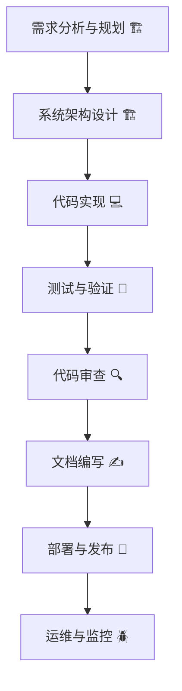

# 软件开发标准操作流程(SOP) - ROO Code AI 开发指南

## 引言

本标准操作流程(SOP)专为ROO Code AI提供一套标准化的软件开发流程指南。通过定义明确的开发阶段、对应的ROO Code模式和严格的质量标准，确保AI能够高效、一致地完成软件项目开发。

### 流程核心目标

- **🏆 标准化执行**：提供一致、可重复的开发方法论
- **⚡ 效率优化**：通过专业模式匹配提升各阶段工作效率
- **🛡️ 质量保障**：内置多层次质量控制和验证机制
- **🤝 协作增强**：明确的角色分工和沟通规范

## 开发流程序列

软件开发流程按以下8个阶段顺序执行：

1. **需求分析与规划** 🏗️
2. **系统架构设计** 🏗️
3. **代码实现** 💻
4. **测试与验证** 🧪
5. **代码审查** 🔍
6. **文档编写** ✍️
7. **部署与发布** 🚀
8. **运维与监控** 🪲

## 阶段详细说明

| 阶段 | ROO Code模式 | 主要目标 | 输出物 |
|------|-------------|---------|--------|
| 1. 需求分析与规划 | 🏗️ Architect | 收集分析需求，制定项目计划 | 需求文档、项目计划、用户故事 |
| 2. 系统架构设计 | 🏗️ Architect | 设计系统架构和技术方案 | 架构文档、设计规范、技术选型报告 |
| 3. 代码实现 | 💻 Code | 编写高质量的代码 | 源代码、单元测试、代码文档 |
| 4. 测试与验证 | 🧪 Test | 确保代码质量和功能正确性 | 测试报告、测试用例、覆盖率报告 |
| 5. 代码审查 | 🔍 PR Reviewer | 识别和修复代码问题 | 审查报告、改进建议、质量评估 |
| 6. 文档编写 | ✍️ Documentation Writer | 创建完整的技术文档 | API文档、用户指南、使用说明 |
| 7. 部署与发布 | 🚀 DevOps | 自动化部署和发布管理 | 部署脚本、发布说明、环境配置 |
| 8. 运维与监控 | 🪲 Debug | 系统监控和问题排查 | 监控报告、故障分析、性能指标 |

## SOP文档清单

### 核心SOP文档
1. **01-requirements-analysis.md** - 需求分析与规划阶段详细指南
2. **02-system-design.md** - 系统架构设计阶段详细指南
3. **03-code-implementation.md** - 代码实现阶段详细指南
4. **04-testing-verification.md** - 测试与验证阶段详细指南
5. **05-code-review.md** - 代码审查阶段详细指南
6. **06-documentation-writing.md** - 文档编写阶段详细指南
7. **07-deployment-release.md** - 部署与发布阶段详细指南
8. **08-operations-monitoring.md** - 运维与监控阶段详细指南

### 任务管理文档
- **tasks/original-requirements.md** - 原始需求内容存储
- **tasks/task-completion-report.md** - 任务完成报告模板

## 开发流程图

## 质量标准

### 🔧 代码质量标准
- **📖 可读性**：代码结构清晰，命名规范，注释完整
- **🔄 一致性**：遵循项目编码规范和最佳实践
- **⚡ 性能**：满足性能指标，无明显性能瓶颈
- **🔒 安全性**：遵循安全编码规范，无已知安全漏洞
- **🧪 可测试性**：代码模块化，测试覆盖率≥80%

### 📚 文档质量标准
- **✅ 完整性**：覆盖所有功能、API和使用场景
- **🎯 准确性**：信息准确，示例代码可直接运行
- **🔍 可访问性**：文档结构清晰，易于查找和浏览

### 🔄 流程质量标准
- **👀 透明度**：开发过程可追踪，可审查历史
- **🔗 可追溯性**：需求到实现的完整追踪链

## ROO Code模式使用指南

### 🏗️ Architect模式 - 架构与规划
**适用阶段**：1-2阶段
**核心能力**：系统分析、架构设计、技术选型

### 💻 Code模式 - 代码实现
**适用阶段**：3阶段
**核心能力**：功能开发、代码重构、性能优化

### 🧪 Test模式 - 测试验证
**适用阶段**：4阶段
**核心能力**：编写测试用例、执行自动化测试

### 🔍 PR Reviewer模式 - 代码审查
**适用阶段**：5阶段
**核心能力**：代码质量评估、缺陷识别、安全检查

### ✍️ Documentation Writer模式 - 文档编写
**适用阶段**：6阶段
**核心能力**：技术文档编写、内容组织、格式化

### 🚀 DevOps模式 - 部署运维
**适用阶段**：7-8阶段
**核心能力**：CI/CD配置、环境管理、监控告警

### 🪲 Debug模式 - 问题诊断
**适用阶段**：8阶段
**核心能力**：问题诊断、性能分析、故障排查

## 最佳实践

### 阶段转换规则
1. **顺序执行**：只有当前阶段完成后才能进入下一阶段
2. **质量门禁**：关键阶段需要正式评审和批准
3. **问题回退**：发现问题时可回退到前一阶段进行修正

### 质量控制体系
- **标准明确**：每个阶段都有明确的完成标准和检查清单
- **同行评审**：实施强制性的同行评审机制
- **自动化检查**：集成代码质量检查和测试自动化

---

*本SOP文档为ROO Code AI提供标准化的开发流程序列，确保AI能够按照规范流程完成高质量的软件开发任务。*