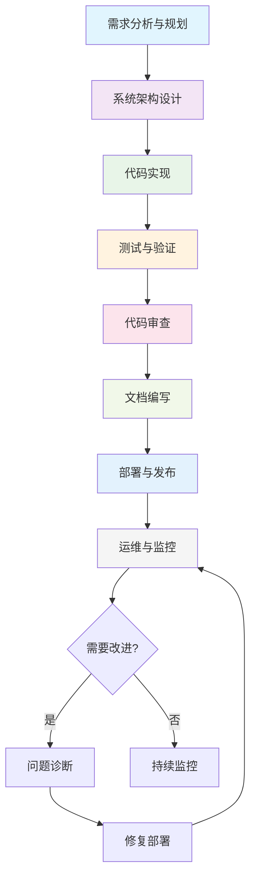

# 软件开发标准操作流程(SOP)

## 引言

本标准操作流程(SOP)旨在为ROO Code开发团队提供一套标准化的软件开发流程指南。通过定义明确的开发阶段、对应的ROO Code模式和质量标准，确保开发过程的一致性、高效性和可维护性。

### 流程概述和目标

本SOP流程基于ROO Code的多模式架构，涵盖了从需求分析到部署维护的完整软件开发生命周期。目标包括：

- **标准化开发流程**：提供一致的开发方法论
- **提高开发效率**：通过合适的模式和工具优化各阶段工作
- **确保代码质量**：内置质量保证机制和标准
- **促进团队协作**：明确的角色分工和沟通规范
- **支持持续改进**：可度量的流程和反馈机制

## 流程阶段总览

软件开发流程分为8个主要阶段，每个阶段都有对应的ROO Code模式和特定的目标：

1. **需求分析与规划** - 需求收集、分析和项目规划
2. **系统架构设计** - 技术架构和系统设计
3. **代码实现** - 功能开发和代码编写
4. **测试与验证** - 单元测试、集成测试和验证
5. **代码审查** - 同行评审和代码质量检查
6. **文档编写** - 技术文档和用户文档
7. **部署与发布** - 应用部署和版本发布
8. **运维与监控** - 系统运维和性能监控

## 各阶段简述表格

| 阶段 | ROO Code模式 | 主要目标 | 输出物 | 关键活动 |
|------|-------------|---------|--------|----------|
| 1. 需求分析与规划 | 🏗️ Architect | 收集和分析需求，制定项目计划 | 需求文档、项目计划 | 用户访谈、需求建模、优先级排序 |
| 2. 系统架构设计 | 🏗️ Architect | 设计系统架构和技术方案 | 架构文档、设计规范 | 架构评审、设计模式选择、技术选型 |
| 3. 代码实现 | 💻 Code | 编写高质量的代码 | 源代码、单元测试 | 功能开发、代码重构、性能优化 |
| 4. 测试与验证 | 🧪 Test | 确保代码质量和功能正确性 | 测试报告、测试用例 | 单元测试、集成测试、系统测试 |
| 5. 代码审查 | 🔍 PR Reviewer | 识别和修复代码问题 | 审查报告、改进建议 | 代码走查、缺陷识别、质量评估 |
| 6. 文档编写 | ✍️ Documentation Writer | 创建完整的技术文档 | API文档、用户指南、使用说明 | 文档结构设计、内容编写、格式化 |
| 7. 部署与发布 | 🚀 DevOps | 自动化部署和发布管理 | 部署脚本、发布说明 | CI/CD配置、环境管理、版本控制 |
| 8. 运维与监控 | 🪲 Debug | 系统监控和问题排查 | 监控报告、故障分析 | 性能监控、日志分析、问题诊断 |

## SOP文档完整清单

### 核心SOP文档
1. **01-requirements-analysis.md** - 需求分析与规划阶段 SOP
2. **02-system-design.md** - 系统架构设计阶段 SOP
3. **03-code-implementation.md** - 代码实现阶段 SOP
4. **04-testing-verification.md** - 测试与验证阶段 SOP
5. **05-code-review.md** - 代码审查阶段 SOP
6. **06-documentation-writing.md** - 文档编写阶段 SOP
7. **07-deployment-release.md** - 部署与发布阶段 SOP
8. **08-operations-monitoring.md** - 运维与监控阶段 SOP

### 任务管理文档
- **tasks/original-requirements.md** - 原始需求内容存储
- **tasks/task-completion-report.md** - 任务完成报告

### 优化改进项目
- **projects/sop-optimization/** - SOP优化改进项目文档
  - 项目章程和需求分析
  - 架构设计文档
  - 用户故事和用例
  - 业务流程图

## 流程图

## 质量标准

### 代码质量标准

- **可读性**：代码应易于理解和维护
- **一致性**：遵循项目编码规范和最佳实践
- **性能**：满足性能要求，无明显性能瓶颈
- **安全性**：遵循安全编码规范，无已知安全漏洞
- **可测试性**：代码应易于测试，测试覆盖率≥80%

### 文档质量标准

- **完整性**：覆盖所有必要的功能和API
- **准确性**：信息准确，示例代码可运行
- **时效性**：文档与代码版本保持同步
- **可访问性**：文档易于查找和浏览
- **实用性**：提供清晰的使用指导和示例

### 流程质量标准

- **及时性**：各阶段按计划完成
- **透明度**：开发过程可追踪和审查
- **可追溯性**：需求到实现的完整追踪
- **可重复性**：流程可重复执行和改进
- **可度量性**：关键指标可量化测量

## 使用指南

### 模式使用指南

1. **🏗️ Architect模式**
   - 用于需求分析和架构设计阶段
   - 适用场景：系统设计、技术选型、项目规划
   - 使用建议：优先考虑系统整体架构和长期可维护性

2. **💻 Code模式**
   - 用于代码实现阶段
   - 适用场景：功能开发、代码重构、性能优化
   - 使用建议：遵循TDD原则，注重代码质量和可测试性

3. **🧪 Test模式**
   - 用于测试与验证阶段
   - 适用场景：编写测试用例、执行自动化测试
   - 使用建议：确保测试覆盖所有边界条件和异常场景

4. **🔍 PR Reviewer模式**
   - 用于代码审查阶段
   - 适用场景：Pull Request审查、代码质量评估
   - 使用建议：重点关注代码规范、安全性和性能问题

5. **✍️ Documentation Writer模式**
   - 用于文档编写阶段
   - 适用场景：API文档、用户指南、技术规范
   - 使用建议：确保文档结构清晰，内容完整准确

6. **🚀 DevOps模式**
   - 用于部署与发布阶段
   - 适用场景：CI/CD配置、环境管理、自动化部署
   - 使用建议：注重部署稳定性和回滚策略

7. **🪲 Debug模式**
   - 用于运维与监控阶段
   - 适用场景：问题诊断、性能监控、故障排查
   - 使用建议：系统性分析问题根因，提供长期解决方案

### 最佳实践

1. **阶段转换规则**
   - 只有当前阶段完成后才能进入下一阶段
   - 关键阶段需要正式评审和批准
   - 发现问题时可回退到前一阶段进行修正

2. **沟通规范**
   - 使用统一的文档模板和格式
   - 及时更新项目状态和进度
   - 遇到问题及时上报和讨论解决方案

3. **质量控制**
   - 每个阶段都有明确的完成标准
   - 实施同行评审机制
   - 定期进行过程改进和回顾

4. **工具使用**
   - 根据任务性质选择合适的ROO Code模式
   - 充分利用各模式的特性和工具
   - 记录模式使用经验和教训

### 常见问题解答

**Q: 如何选择合适的ROO Code模式？**
A: 根据任务性质和当前开发阶段选择对应的模式。复杂任务可能需要多个模式协同完成。

**Q: 遇到跨阶段问题怎么办？**
A: 可以临时切换到其他模式解决问题，但应记录原因并在适当时候回到标准流程。

**Q: 如何确保流程执行的一致性？**
A: 定期培训、使用检查清单、实施自动化工具来确保流程一致性。

---

*本SOP文档将根据项目经验和反馈持续更新和优化。建议每个项目团队根据实际情况进行调整和改进。*