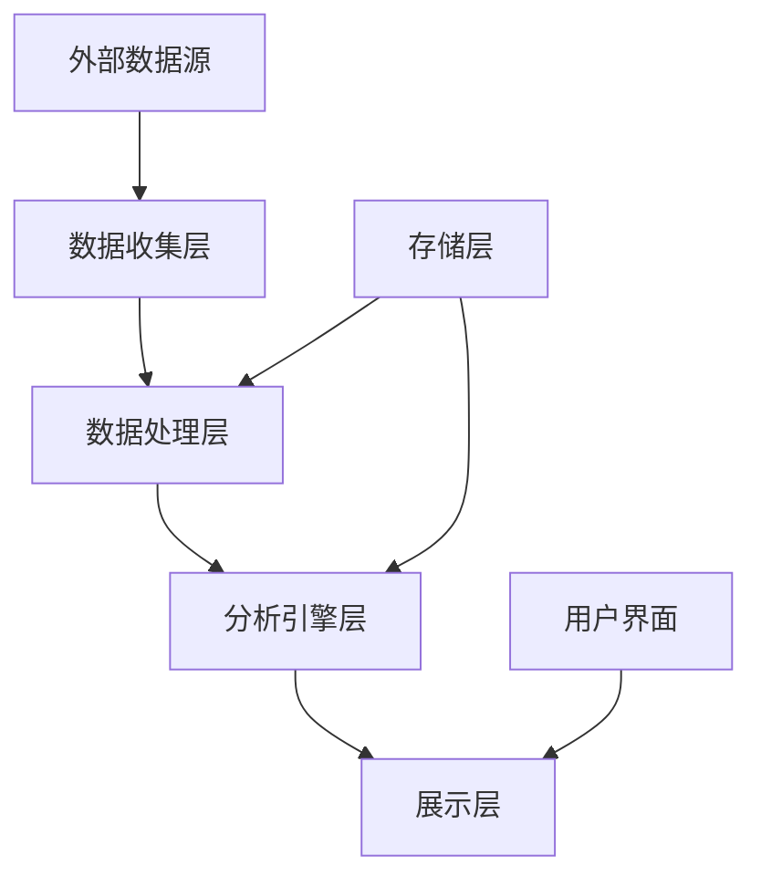

# Roo-Code分析系统架构设计

## 架构设计故事

### 架构设计用户故事

**标题:** 系统架构设计

**As a** 系统架构师,  
**I want to** 设计一个可扩展的分析系统架构,  
**So that** 可以高效地进行Roo-Code的功能分析、竞品对比和创新研究.

**验收标准:**
1. 架构支持数据收集、分析处理和结果展示
2. 系统具有良好的可扩展性和可维护性
3. 支持多种数据源和分析方法
4. 提供RESTful API接口
5. 数据处理性能满足要求

## 系统架构

### 总体架构



### 技术栈选型

#### 后端技术栈
- **编程语言**: Python 3.9+
- **Web框架**: FastAPI (异步高性能)
- **数据库**: PostgreSQL (关系数据) + MongoDB (文档数据)
- **缓存**: Redis
- **消息队列**: RabbitMQ
- **容器化**: Docker + Kubernetes

#### 前端技术栈
- **框架**: React 18 + TypeScript
- **UI库**: Material-UI + Tailwind CSS
- **状态管理**: Redux Toolkit
- **图表库**: D3.js + Recharts
- **构建工具**: Vite

#### 数据分析技术栈
- **数据处理**: Pandas + NumPy
- **机器学习**: Scikit-learn + TensorFlow
- **自然语言处理**: SpaCy + NLTK
- **可视化**: Matplotlib + Seaborn

### 组件架构

#### 1. 数据收集器 (Data Collector)
**职责**: 从各种数据源收集信息
- **功能模块**:
  - Web爬虫模块
  - API数据收集器
  - 文档解析器
  - 数据清洗器

**技术实现**:
- 使用Scrapy进行网页抓取
- 实现API客户端
- 使用PyPDF2和python-docx解析文档
- 数据清洗和标准化处理

#### 2. 数据存储层 (Data Storage)
**职责**: 数据持久化存储和管理
- **数据库设计**:
  - 关系型数据：PostgreSQL
  - 非结构化数据：MongoDB
  - 缓存数据：Redis
  - 文件存储：MinIO

**数据模型**:
```sql
-- 功能信息表
CREATE TABLE features (
    id SERIAL PRIMARY KEY,
    name VARCHAR(255) NOT NULL,
    description TEXT,
    category VARCHAR(100),
    created_at TIMESTAMP DEFAULT CURRENT_TIMESTAMP
);

-- 竞品信息表
CREATE TABLE competitors (
    id SERIAL PRIMARY KEY,
    name VARCHAR(255) NOT NULL,
    website VARCHAR(500),
    description TEXT,
    market_position VARCHAR(100)
);

-- 对比分析表
CREATE TABLE comparisons (
    id SERIAL PRIMARY KEY,
    feature_id INTEGER REFERENCES features(id),
    competitor_id INTEGER REFERENCES competitors(id),
    roo_code_score DECIMAL(3,2),
    competitor_score DECIMAL(3,2),
    analysis TEXT,
    created_at TIMESTAMP DEFAULT CURRENT_TIMESTAMP
);
```

#### 3. 分析引擎 (Analysis Engine)
**职责**: 实现各种分析算法和模型
- **分析模块**:
  - 功能相似性分析
  - 市场定位分析
  - 趋势预测分析
  - 竞争优势分析

**算法实现**:
- 余弦相似度计算
- TF-IDF文本分析
- K-means聚类分析
- 决策树分类

#### 4. API服务层 (API Services)
**职责**: 提供RESTful API接口
- **主要接口**:
  - GET /api/features - 获取功能列表
  - POST /api/competitors - 添加竞品信息
  - GET /api/analysis/compare - 获取对比分析
  - POST /api/reports/generate - 生成分析报告

**接口设计**:
```python
from fastapi import FastAPI
from pydantic import BaseModel

app = FastAPI()

class FeatureCreate(BaseModel):
    name: str
    description: str
    category: str

@app.post("/api/features")
async def create_feature(feature: FeatureCreate):
    # 实现逻辑
    return {"message": "Feature created successfully"}
```

#### 5. 用户界面层 (User Interface)
**职责**: 提供用户友好的交互界面
- **主要页面**:
  - 仪表板页面
  - 功能分析页面
  - 竞品对比页面
  - 报告展示页面

**界面设计**:
- 响应式设计
- 交互式图表
- 实时数据更新
- 直观的操作流程

### 部署架构

#### 开发环境
```yaml
version: '3.8'
services:
  web:
    build: .
    ports:
      - "8000:8000"
    environment:
      - DATABASE_URL=postgresql://user:password@db:5432/roo_analysis
    depends_on:
      - db
      - redis

  db:
    image: postgres:13
    environment:
      - POSTGRES_DB=roo_analysis
      - POSTGRES_USER=user
      - POSTGRES_PASSWORD=password

  redis:
    image: redis:6-alpine
```

#### 生产环境
- **容器编排**: Kubernetes
- **服务网格**: Istio
- **监控**: Prometheus + Grafana
- **日志**: ELK Stack
- **CI/CD**: GitHub Actions

### 安全设计

#### 数据安全
1. **数据加密**:
   - 传输层：TLS 1.3
   - 存储层：AES-256加密
   - 敏感数据：额外加密处理

2. **访问控制**:
   - JWT身份认证
   - 基于角色的权限控制
   - API限流和防爬虫

3. **安全审计**:
   - 操作日志记录
   - 异常行为检测
   - 定期安全扫描

### 性能优化

#### 系统性能
1. **缓存策略**:
   - Redis缓存热点数据
   - 静态资源CDN加速
   - 数据库查询结果缓存

2. **异步处理**:
   - 长时间任务异步执行
   - 消息队列解耦
   - 事件驱动架构

3. **数据库优化**:
   - 索引优化
   - 查询优化
   - 分库分表设计

### 可扩展性设计

#### 水平扩展
1. **无状态设计**:
   - 应用服务无状态
   - 配置中心化管理
   - 数据持久化分离

2. **微服务架构**:
   - 服务独立部署
   - API网关统一入口
   - 服务间异步通信

3. **插件化扩展**:
   - 分析算法插件化
   - 数据源适配器
   - 报告模板扩展

### 监控和运维

#### 系统监控
1. **应用监控**:
   - 响应时间监控
   - 错误率监控
   - 资源使用监控

2. **业务监控**:
   - 用户行为分析
   - 功能使用统计
   - 分析任务状态

3. **告警机制**:
   - 多渠道告警
   - 智能告警抑制
   - 告警升级机制

## 架构质量属性

### 可用性
- **目标**: 99.9%可用性
- **策略**: 多实例部署、自动故障转移
- **监控**: 实时健康检查、故障自动恢复

### 可维护性
- **目标**: 代码可读性高、模块化好
- **策略**: 遵循设计模式、文档完善
- **监控**: 代码质量指标、技术债务跟踪

### 安全性
- **目标**: 通过安全审计、无已知漏洞
- **策略**: 安全开发生命周期、安全编码规范
- **监控**: 安全扫描、漏洞检测、威胁监控

### 性能
- **目标**: 页面响应时间<2秒，API响应时间<500ms
- **策略**: 性能优化、缓存策略、CDN加速
- **监控**: 性能指标监控、用户体验监控

## 技术债务管理

### 已知技术债务
1. **短期债务**: 代码重复、测试覆盖不足
2. **中期债务**: 架构重构、性能优化
3. **长期债务**: 技术栈升级、架构演进

### 债务偿还计划
1. **立即处理**: 严重影响系统稳定性的问题
2. **计划处理**: 影响开发效率的代码质量问题
3. **持续改进**: 架构优化和技术升级

## 风险评估

### 技术风险
- **高风险**: 新技术集成失败
- **中风险**: 性能瓶颈
- **低风险**: 第三方服务依赖

### 缓解策略
1. **原型验证**: 新技术先做概念验证
2. **性能测试**: 关键功能进行压力测试
3. **备用方案**: 重要依赖准备替代方案

---

*架构设计完成时间：2025-08-21 13:06 UTC+8*
*架构设计师：系统分析项目团队*