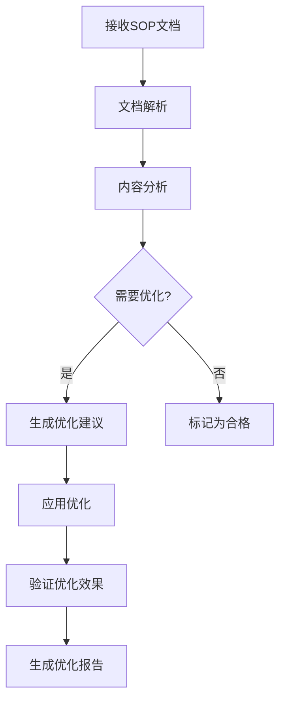
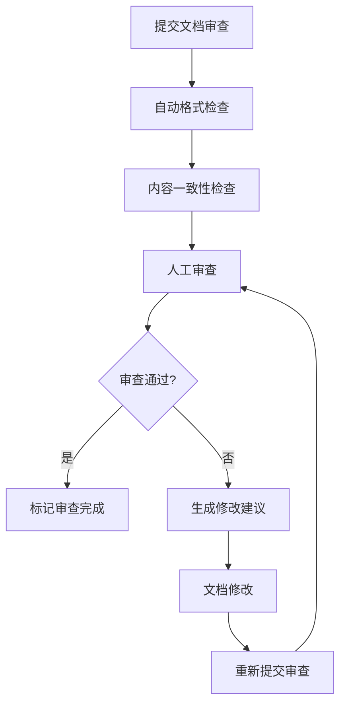
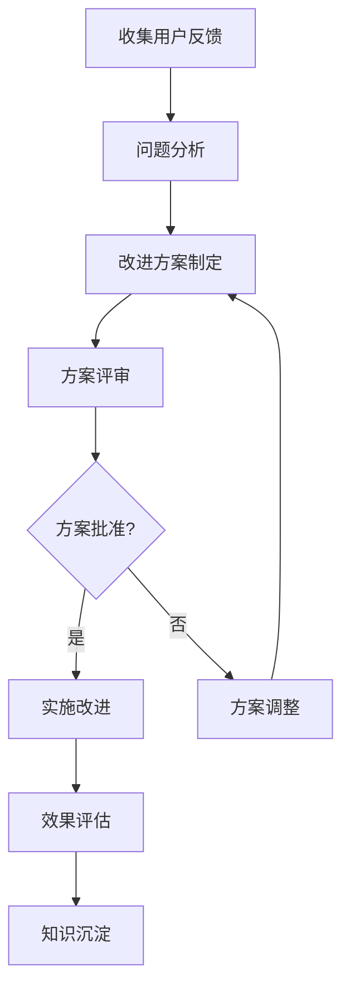
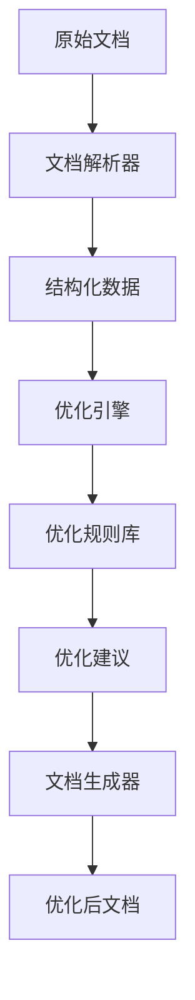
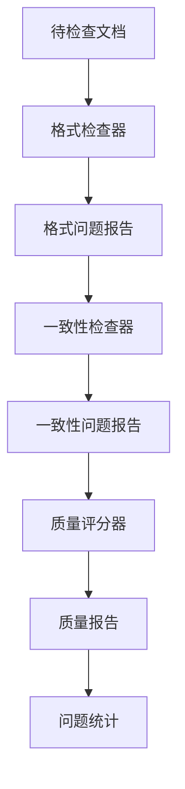
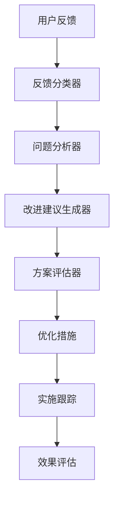

# 业务流程图和数据流图

## 主要业务流程

### 1. SOP文档优化流程

### 2. 文档审查流程

### 3. 持续改进流程

## 数据流图

### 1. 文档处理数据流

### 2. 质量检查数据流

### 3. 用户反馈数据流

## 流程详细说明

### SOP文档优化流程

#### 步骤1：文档接收
- **输入**：原始SOP文档（Markdown格式）
- **处理**：验证文档格式和完整性
- **输出**：格式验证报告

#### 步骤2：文档解析
- **输入**：验证通过的文档
- **处理**：解析Markdown结构，提取标题、段落、列表等元素
- **输出**：结构化文档对象

#### 步骤3：内容分析
- **输入**：结构化文档对象
- **处理**：应用优化规则进行内容分析
- **输出**：分析报告和问题清单

#### 步骤4：优化判断
- **输入**：分析报告
- **处理**：根据预设阈值判断是否需要优化
- **输出**：优化决策结果

#### 步骤5：优化建议生成
- **输入**：需要优化的文档
- **处理**：应用优化算法生成改进建议
- **输出**：详细的优化建议清单

#### 步骤6：优化应用
- **输入**：优化建议清单
- **处理**：自动或手动应用优化建议
- **输出**：优化后的文档

#### 步骤7：效果验证
- **输入**：优化后的文档
- **处理**：重新进行内容分析和质量检查
- **输出**：优化效果报告

### 文档审查流程

#### 步骤1：审查准备
- **输入**：待审查文档
- **处理**：分配审查任务，准备审查环境
- **输出**：审查任务分配表

#### 步骤2：自动检查
- **输入**：文档文件
- **处理**：运行自动化检查工具
- **输出**：自动化检查报告

#### 步骤3：人工审查
- **输入**：自动化检查报告 + 原始文档
- **处理**：审查人员进行人工检查
- **输出**：审查意见和建议

#### 步骤4：审查决策
- **输入**：审查意见
- **处理**：根据审查标准做出通过/修改决策
- **输出**：审查结果

#### 步骤5：修改实施
- **输入**：修改建议
- **处理**：文档作者实施修改
- **输出**：修改后的文档

### 持续改进流程

#### 步骤1：反馈收集
- **输入**：用户反馈、问题报告、使用数据
- **处理**：分类整理反馈信息
- **输出**：反馈汇总报告

#### 步骤2：问题分析
- **输入**：反馈汇总报告
- **处理**：分析问题根因和影响范围
- **输出**：问题分析报告

#### 步骤3：方案制定
- **输入**：问题分析报告
- **处理**：制定具体的改进方案
- **输出**：改进方案文档

#### 步骤4：方案评审
- **输入**：改进方案
- **处理**：技术团队评审方案可行性
- **输出**：评审意见和建议

#### 步骤5：实施改进
- **输入**：批准的改进方案
- **处理**：按照方案实施改进
- **输出**：改进实施记录

## 数据实体定义

### 1. 文档实体
- **属性**：
  - 文档ID（唯一标识）
  - 文档标题
  - 文档内容
  - 文档格式
  - 创建时间
  - 修改时间
  - 版本号
  - 状态

### 2. 优化规则实体
- **属性**：
  - 规则ID
  - 规则名称
  - 规则描述
  - 规则类型
  - 优先级
  - 启用状态

### 3. 问题报告实体
- **属性**：
  - 问题ID
  - 问题类型
  - 问题描述
  - 严重程度
  - 状态
  - 报告人
  - 报告时间

### 4. 用户反馈实体
- **属性**：
  - 反馈ID
  - 用户ID
  - 反馈内容
  - 反馈类型
  - 反馈时间
  - 处理状态

## 流程质量控制

### 质量检查点
1. **文档接收检查点**：
   - 格式正确性
   - 完整性验证
   - 版本一致性

2. **解析过程检查点**：
   - 解析准确性
   - 数据完整性
   - 错误处理

3. **优化过程检查点**：
   - 规则应用正确性
   - 优化效果验证
   - 性能影响评估

4. **输出检查点**：
   - 文档格式正确性
   - 内容完整性
   - 质量标准符合性

### 异常处理流程
1. **格式异常**：
   - 检测异常 → 记录错误 → 通知用户 → 要求重新提交

2. **解析异常**：
   - 检测异常 → 尝试修复 → 记录问题 → 人工介入处理

3. **优化异常**：
   - 检测异常 → 回滚优化 → 记录问题 → 改进优化规则

4. **系统异常**：
   - 检测异常 → 系统恢复 → 记录问题 → 系统改进

## 性能要求

### 处理性能
- **文档解析速度**：≤5秒/文档
- **优化处理速度**：≤10秒/文档
- **报告生成速度**：≤2秒/报告

### 并发性能
- **最大并发用户数**：50用户
- **系统响应时间**：≤2秒（95%请求）
- **错误率**：≤1%

### 资源利用率
- **CPU使用率**：≤70%（平均）
- **内存使用率**：≤80%（平均）
- **磁盘I/O**：≤1000 IOPS